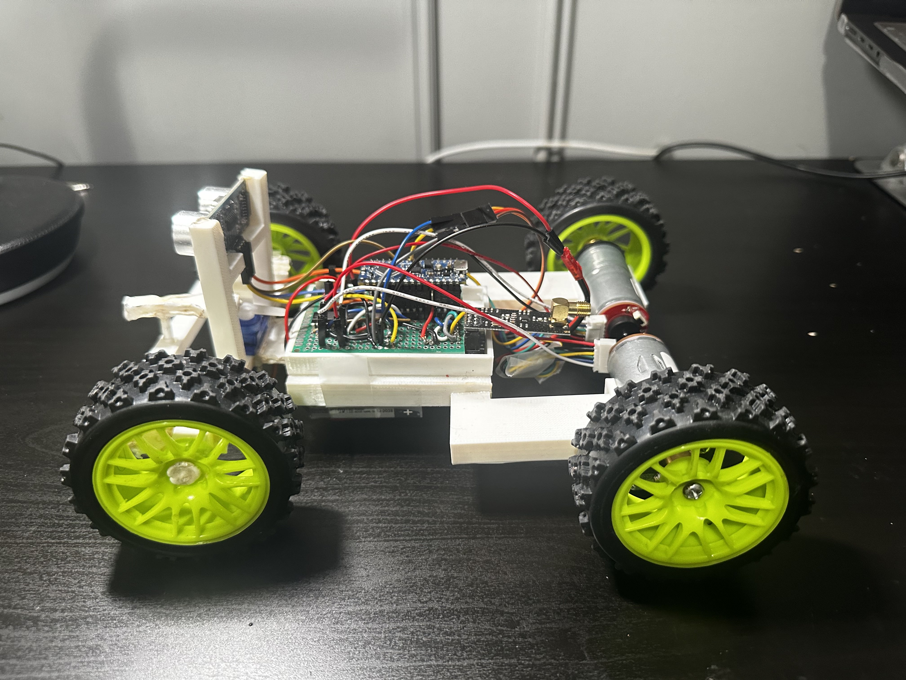
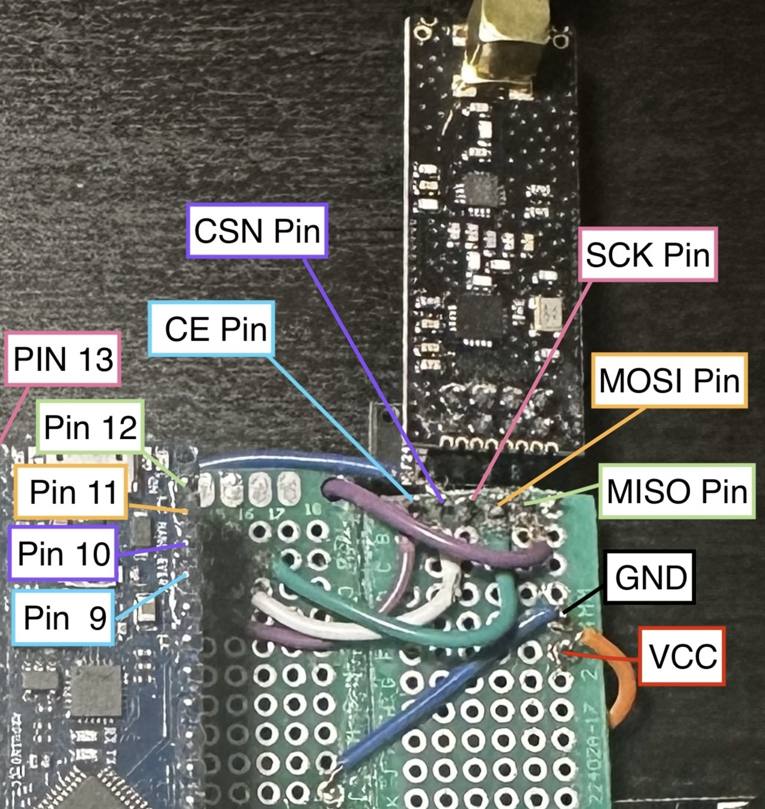
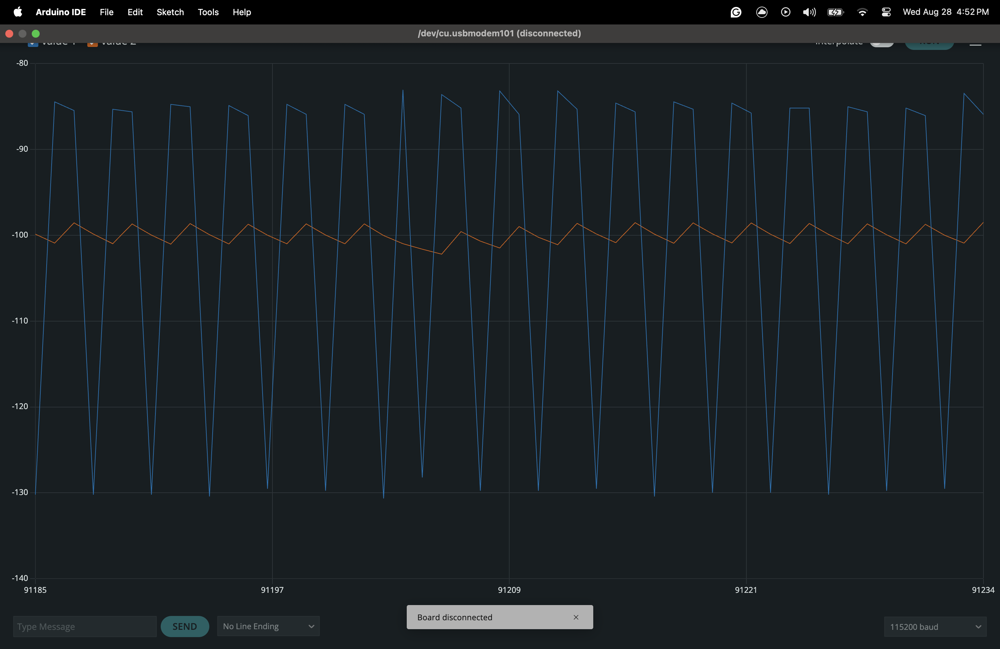

# Semi-Autonomous-RC-Car

## Description

I developed and designed an RC car from scratch, incorporating semi-autonomous features such as adaptive cruise control and low-speed emergency braking. Driven by a passion for embedded software development and automotive engineering, I integrated these interests into a project that aims to advance the capabilities of remote-controlled vehicles.

The RC car is built around an Arduino Nano microcontroller. For steering, I implemented a servo motor at the front wheel shaft and for the movement, I used 2 DC-encoded motors controlled using a L293D quadruple half-H driver. I designed and tested different prototypes on AutoCad and printed them using a 3D printer.

I used an SPI communication protocol on nRF24L01 modules, allowing seamless communication with the controller and the car. The controller has two joysticks for manual control of the car’s movement. For the Advanced Driver Assistance System (ADAS) features, I used an  HC-SR04 ultrasonic sensor at the front of the car to detect the distance of objects in front of the car which allowed me to implement low-speed braking and adaptive cruise control.

## Table of Contents 

- [SPI Communication](#SPI-Communication)
- [Motor Driver](#Motor_driver)
- [Cruise control](#Cruise_Control)
- [Adaptive cruise control](#Adaptive_Cruise_Control)
- [Low-speed braking](#Low-speed_braking)

## SPI-Communication
I employed an nRF24L01 Transceiver Module, which uses SPI (Serial Peripheral Interface) communication. On the controller side, one nRF24L01 module acts as the master, while another nRF24L01 on the RC car serves as the receiver. I utilized an adapter to facilitate the connection of the nRF24L01 to the PCB, allowing for straightforward plug-in and soldering.

For power, the GND pin of the nRF24L01 is connected to the Arduino’s ground, and the VCC pin is connected to the Arduino’s 3.3V output. The CE (Chip Enable) pin, which is active-high, is connected to pin 9 on the Arduino. When enabled, this pin allows the nRF24L01 to either transmit or receive data. The CSN (Chip Select Not) pin, an active-low signal, is linked to pin 10 on the Arduino. This pin must be set low for the nRF24L01 to listen for data on the SPI bus.

The SCK (Serial Clock) pin, responsible for receiving clock pulses from the SPI bus master, is connected to pin 13 on the Arduino. The MOSI (Master Out Slave In) and MISO (Master In Slave Out) pins handle data transmission: MOSI (SPI input) is connected to pin 11, while MISO (SPI output) is connected to pin 12 on the Arduino.

The Arduino receives input from the joysticks, which it then sends to the master nRF24L01 module. This master module transmits the data to the nRF24L01 module on the RC car. The receiver module on the car then sends this data to the Arduino, where it is processed and used to control the RC car’s movements.

## Motor_driver

The movement of the RC car is managed by two DC motors equipped with encoders, powered by an 11.1V lithium battery and a 9V battery. Once the transmitter sends data, it is processed by the Arduino, which then updates the servo and DC motors accordingly.

For the servo motor, the Arduino translates input values ranging from 0 to 1023 into an angular range of 0 to 180 degrees. These values are then sent to the servo motor to adjust its position. Similarly, joystick inputs ranging from 0 to 1023 are converted to a scale of 0 to 255 for the two DC encoder motors, allowing precise control over their speed and direction.

Movement is controlled using an L293D quadruple half-H driver (motor driver). The speed of the motors is regulated through the speed pin, which adjusts the voltage applied to the motors based on the current. Direction is managed by the forward and backward pins: setting the forward pin high and the backward pin low moves the RC car forward, while the reverse configuration moves it backward.

## Cruise_Control
Cruise control is a widely used feature in modern vehicles, designed to maintain a set speed, which is particularly beneficial on highways and during long drives. I've implemented a similar functionality in my RC car using a DC motor encoder to track the motor shaft's position.

The encoder operates by detecting the magnetic field from a magnet attached to the motor shaft. As the shaft turns, it generates two signals, A and B, that alternate between HIGH and LOW values. The Arduino monitors these signals and triggers an interrupt to execute a `readEncoder` function. This function determines the direction of rotation based on the sequence of the signals: if signal A leads signal B, the position increments, indicating clockwise rotation; if B leads A, the position decrements, indicating counterclockwise rotation.

To calculate the RC car’s speed, I measure the change in position (pos - posPrev) over the change in time (currT - prevT). Position is tracked by the encoder, while time is measured using the `micros()` function. To convert shaft velocity (positions per second) into wheel velocity (km/h), I first determined that one wheel revolution equals 680 encoder positions. With the wheel circumference at 21.67 cm, I convert shaft velocity to wheel velocity in cm/s by dividing the shaft velocity by 680 and multiplying by 21.67 cm. I then convert this to km/h by multiplying by 3600 seconds and dividing by 100,000 cm. Given the high-frequency noise in the raw velocity data, I apply a low-pass filter to smooth the measurements. The filtered results are shown in the image below, with the pre-filter velocity in blue and the post-filter velocity in orange.

To achieve precise cruise control, I employ a PID (Proportional-Integral-Derivative) controller. The controller compares the actual speed, measured by the encoder, to the desired set speed. The difference, or error, is used to compute a control signal through the PID algorithm. This control signal adjusts the motor’s speed and direction to minimize the error continuously. I've tested and fine-tuned the PID constants to enhance the system's efficiency and accuracy. The image below shows the feedback loop and the PID control formula.

## Adaptive_Cruise_Control
Adaptive cruise control enables the RC car to maintain a constant distance from the vehicle ahead by adjusting its speed accordingly. As the car in front accelerates, the RC car speeds up, and as the car in front slows down, the RC car decelerates. I implemented this feature using an ultrasonic sensor to measure the distance to the object in front of the RC car. This distance measurement, along with the desired distance, is used in a PID control system similar to the one employed for cruise control.

To test and demonstrate the adaptive cruise control system, I created a controlled environment using a treadmill and placed a box in front of the RC car. With the desired distance set to 20 cm, the RC car automatically adjusts its speed to maintain the desired distance with the box as I increase the treadmill’s speed. Check out the youtube video linked below to watch the demonstration.
https://youtu.be/pqxNSgz4KEY 

## Low-speed_braking

